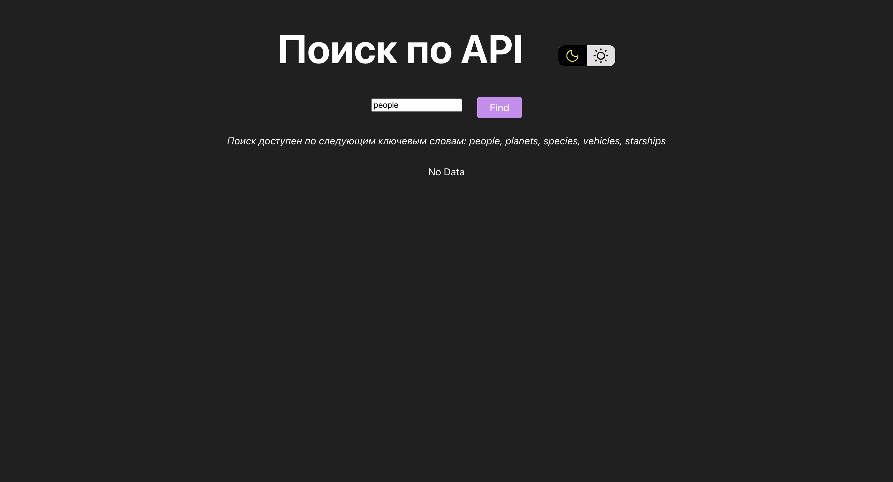
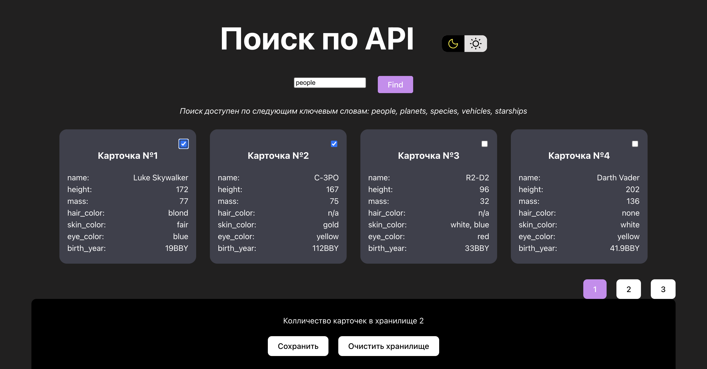
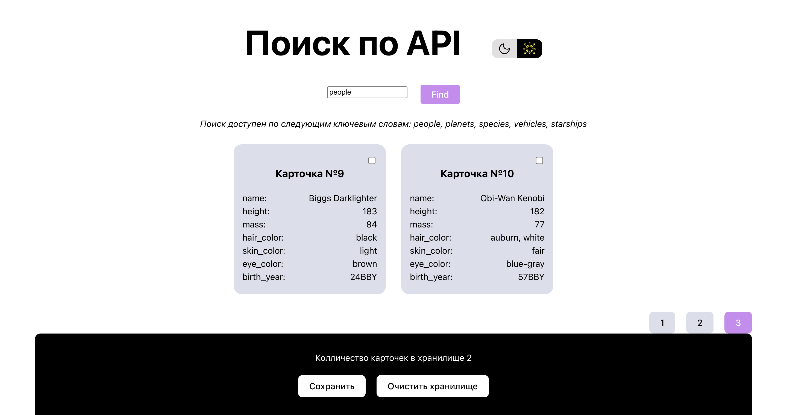

# 🔍 SWAPI Search App

Приложение для поиска по [Star Wars API (SWAPI)](https://swapi.dev/)  
Создано с использованием **React**, **TypeScript**, **Redux Toolkit** и **Vite**.

## 🚀 Демка

[Открыть демо](https://vemikx.github.io/apiSearch/)

## 🛠️ Технологии

- ⚛️ React 18
- 🔷 TypeScript
- 📦 Redux Toolkit
- 🔍 Поиск по API SWAPI
- 📁 Списки с пагинацией
- 💾 Выбор и сохранение карточек
- 🌗 Темная и светлая тема

## 🖼️ Скриншоты





## 📂 Структура проекта

```bash
src/
├── assets/             # Иконки и стили
├── Components/         # Компоненты интерфейса
├── features/           # Redux Slice'ы
├── Interface/          # Общие типы TypeScript
├── Providers/          # Контекст
└── App.tsx             # Точка входа
```

## 🧪 Запуск проекта

git clone https://github.com/vemikx/apiSearch.git

# Установить зависимости
npm install

# Запустить локально
npm run dev